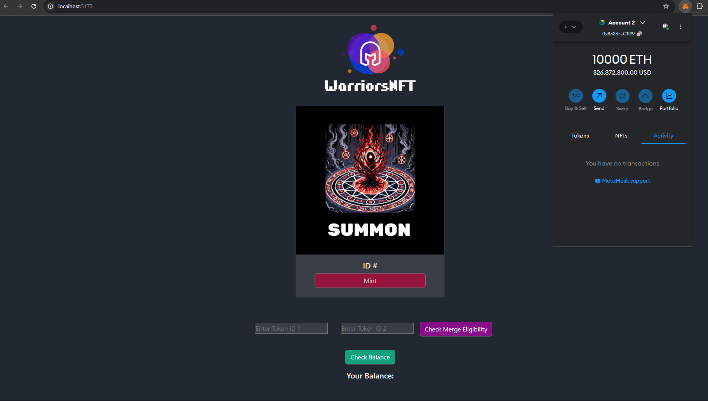
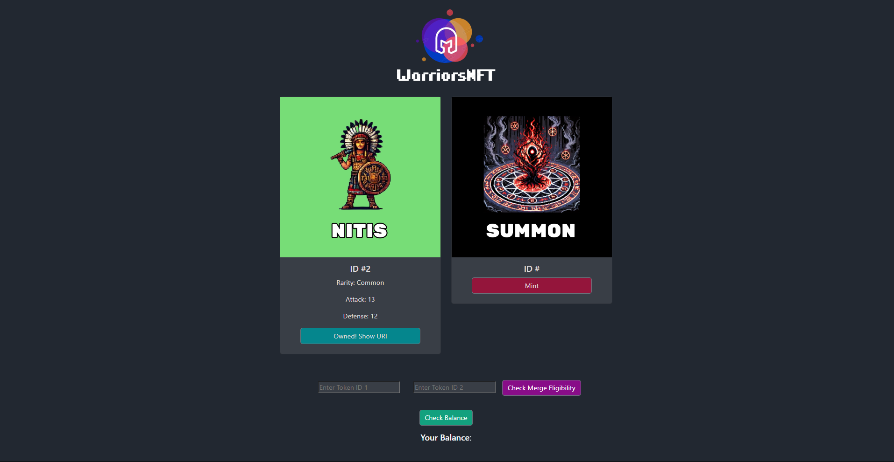
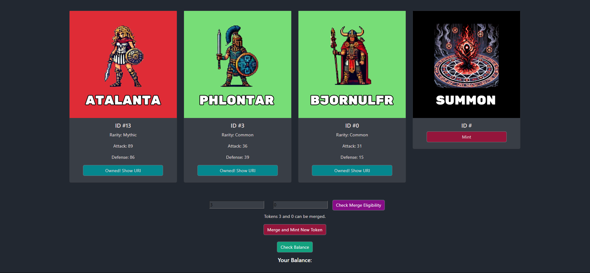
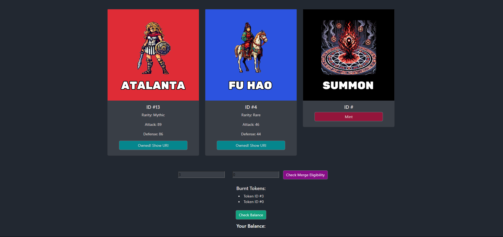
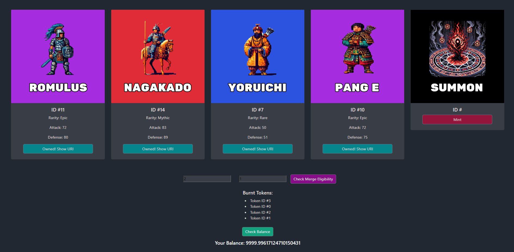

# WarriorsNFT :crossed_swords:
WarriorsNFT is a decentralized application that lets users mint unique warrior NFTs with randomized attributes and merge two NFTs to mint a higher rarity NFT. 
This project demonstrates NFT minting using the ERC721 standard and features a gacha-style minting system with merging capabilities. 

The project is built using React, Solidity, and Hardhat for smart contract development and testing. Bootstrap 5/Reactstrap is used for styling the front-end, creating a responsive user interface. The application interacts with Ethereum smart contracts to handle NFT minting and merging, while React manages the user experience.

## Table of Contents :scroll:
- [Features](#features-star)
- [Installation](#installation-hammer_and_wrench)
- [Usage](#usage-joystick)
- [Limitations & Future Improvements](#limitations-no_entry)
- [Process](#process-bulb)
- [FAQ](#faq-question)

## Features :star:
- **Minting NFTs**: Users can mint NFTs using a gacha system to determine the rarity and stats of the minted NFT.
- **Merging NFTs**: Two NFTs of the same rarity level can be merged/burned to mint a higher-rarity NFT.
- **Metadata Generation for NFT Series**:  Generate metadata for various NFT series to get new stats for the same NFT characters.

## Installation :hammer_and_wrench:
### Steps
1. **Clone the repository**:
    ```bash
    git clone git@github.com:amadzai/nft-mint-and-merge.git
    ```

   *or, if using HTTPS:*
    ```bash
    git clone https://github.com/amadzai/nft-mint-and-merge.git
    ```

2. **Navigate to the project directory**:
    ```bash
    cd nft-mint-and-merge
    ```

3. **Install dependencies**:
    ```bash
    npm install
    ```

4. **Compile the smart contract**:
    ```bash
    npx hardhat compile
    ```

5. **Start a local blockchain**
    ```bash
    npx hardhat node
    ```

6. **Deploy the contract to the local network in a separate terminal**
    ```bash
    npx hardhat run scripts/deploy.cjs --network localhost
    ```

7. **Add contract address to src/components/Home.jsx**
    ```bash
    WarriorsNFT deployed to: 0x5FbDB2315678afecb367f032d93F642f64180aa3
    ```
    Replace the const contractAddress with your contractAddress

8. **Configure MetaMask**:  
    Add the local Hardhat network to MetaMask (usually running on http://localhost:8545) and import one of the accounts from the Hardhat node. You can use the private keys provided by Hardhat in the terminal.

9. **Start the front-end**:
    ```bash
    npm run dev
    ```
    Click to go to the Local URL

10. **Clear MetaMask activity data**:  
    Not required the first time if new account. After the first time, when network 
    is restarted, go to MetaMask -> Settings -> Advanced -> Clear activity tab data to prevent nonce error.

### Optional Steps
1. **Generate new metadata**:  
    ```bash
    node scripts/generateMetadata.js
    ```
    If you would like to add your own images and generate the new metadata, remove the current images from the metadata/images, add yours following the number.png format
    (e.g., 0.png), and the script will create a new folder in metadata/series. Adjust the metadata as needed in the script.

## Usage :joystick:
1. After setting up and navigating to the main page, please make sure MetaMask is on the correct Localhost network, and has no Activity:



2. Mint an NFT by pressing the Mint button, this will use the gacha system to determine which NFT will be minted:



Press the "Owned! Show URI" button to view the Metadata URI for that NFT.

3. To check if 2 minted NFTs can be merge, enter their IDs into the "Enter Token ID" input and boxes, and press the "Check Merge Eligibility" button:



Both NFTs must have already been minted and must be of the same rarity. 

4. Merge the eligible NFTs by pressing the "Merge and Mint New Token" button. This will burn the NFTs to mint a new NFT of a higher rarity. 



If all NFTs in that higher rarity has already been minted, the upgrade will jump to the next rarity, ultimately upgrading it twice. (e.g., Common -> Rare (if all minted) -> Epic)

5. All the burnt tokens used for merging can be seen below, as well as your balance after pressing the "Check Balance" button (minting is free but gas fee is still incurred):



6. After all NFTs have been minted, the "Check Merge Eligibility" button will disappear, and there will be no more new Summon cards to mint. Currently, there is 18 total NFTs. 


